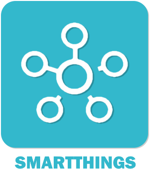

 

 

# Jeedom plugin for Home Connect appliances.

This is a plugin for the Jeedom (https://www.jeedom.com) open source (https://github.com/jeedom) home automation system.

It will permit to control Home Connect enabled appliances.

A demo mode using simulated appliances is also available.

It was originaly created by Sartog.

Sartog's Github repo is at  https://github.com/Sartog/smartthings .

If you find a bug or want to suggest a new feature, please open an issue.