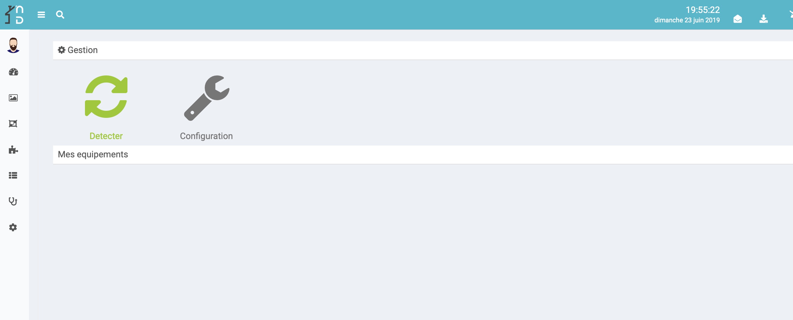

Présentation
===
Plugin de control des éléments SmartThings dans la solution domotique NextDom/Jeedom

Configuration du plugin
===
Après téléchargement du plugin, il vous suffit d'activer celui-ci, puis de le configurer en fournissant votre Token SmartThings.
la creation du token se fait sur le site smartthings.com : https://account.smartthings.com/tokens

A la creation de votre token, activer la liste suivante :
 "Devices", "Installed Applications",  "Locations", "Applications", "Device Profiles" et "Scenes"

## Configuration des équipements

La configuration des équipements SmartThings est accessible à partir du menu plugin->Objet connectés. 
Pour ajouter un équipement, synchronisez avec votre compte SmartThings : cliquer sur  [Détecter] 

Vous retrouvez ici toute la configuration de votre équipement :

* Nom de l'équipement : nom de votre SmartThing
* Objet parent : indique l'objet parent auquel appartient l'équipement,
* Catégorie : les catégories de l'équipement (il peut appartenir à plusieurs catégories).
* Activer : permet de rendre votre équipement actif,
* Visible : rend votre équipement visible sur le dashboard,
* Room  : Piece definie sur l'application SmartThings

View
===
Votre SmartThing :

* 
* 
* 
* 
* 
* 

## Commandes 

Bug
===
En cas de bug avéré du plugin il est possible d'ouvrir une issue :

[https://github.com/NextDom/plugin-SmartThings/issues](https://github.com/NextDom/plugin-SmartThings/issues)
